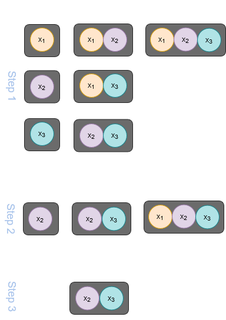
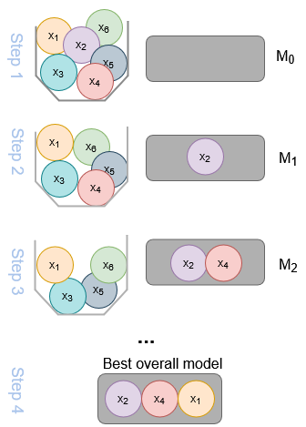

---
jupytext:
  formats: md:myst
  text_representation:
    extension: .md
    format_name: myst
    format_version: 0.13
    jupytext_version: 1.11.5
kernelspec:
  display_name: Python 3
  language: python
  name: python3
myst:
  substitutions:
    ref_test: 1
---

# <i class="fa-brands fa-python"></i> Model Selection
In neurocognitive psychology, brain imaging (e.g., fMRI, EEG), cognitive assessments, and behavioral experiments generate vast datasets, measuring thousands of brain regions, connectivity patterns, and behavioral traits. This data captures everything from patient vitals to cognitive processes and offers **detailed insights** with immense predictive power. However, it also introduces challenges: **too many predictors**, making analysis and interpretation difficult.

## The large p issue
**Big Data** refers to large datasets with many predictors, that cannot be processed or analyzed using traditional data processing techniques. For our prediction models, this brings some issues:
- While the linear model can in theory still be used for such data, the **ordinary least squares fit becomes infeasible**, especially when p > n 
- The large amount of features reduce interpretability


This is where **linear model selection** becomes essential, offering techniques to refine our models and extract meaningful insights from high-dimensional neurocognitive data!

### *Todays data with many predictors - Hitters dataset*
For pracitcal demonstration, we will use the `Hitters` dataset. This data set provides Major League Baseball Data from the 1986 and 1987 seasons. It contains 322 observations of major league players on 20 variables. The Research aim is to predict a baseball player's salary on the basis of various predictors associated with the performance in the previous year.

```{code-cell} 
# import packages
import statsmodels.api as sm 

# get dataset
hitters = sm.datasets.get_rdataset("Hitters", "ISLR").data
```
Get yourself familiar with the dataset. Look at the predictor variables. Which information do we include to predict the salary? 
You can check the variable names here: https://islp.readthedocs.io/en/latest/datasets/Hitters.html  
Also take a closer look to the variable you want to predict! Do we have the information(s) that we need for all players?

<iframe src="https://trinket.io/embed/python3/d980217b790c" width="100%" height="356" frameborder="0" marginwidth="0" marginheight="0" allowfullscreen></iframe>


Okay, now that we know our dataset, let's look at how to handle such a large number of predictors! 


## Handling big data in linear models
To handle large datasets efficiently in linear modeling, three key techniques are used:
- Subset Selection
- Dimension Reduction
- Regularization/Shrinkage 


By leveraging these methods, we can build robust predictive models that remain efficient and interpretable, even in the face of Big Data challenges.


### Subset Selection
In subset selection we identify a subset of *p* predictos that are truly related to the outcome. The model get fitted using least squares on the reduces set of variables.

How do we determine which variables are relevant?! 

####  *Best Subset Selestion*

```{margin}
The Null Model only predicts the sample mean
```

<div style="display: flex; align-items: center;">
  <!-- Picture left -->
  <div style="flex: 0 0 auto; margin-right: 20px; text-align: center;">
    <figure>
      
      <figcaption>Best Subset Selection</figcaption>
    </figure>
  </div>

  <!-- Text on the right -->
  <div style="flex: 1;">
    <ol>
      <li>Consider all possible models
        <ul>
          <li>Starting with Null Model <em>M0</em>, which contains no predictors</li>
          <li>Iteratively adding a predictor to the model</li>
        </ul>
      </li>
      <li>Identify the Best Model of each size
        <ul>
          <li>Either by the smallest RSS or the largest <code>R²</code></li>
        </ul>
      </li>
      <li>Identify the Best Overall Model
        <ul>
          <li>Use cross-validation to find the best <em>Mk</em></li>
        </ul>
      </li>
    </ol>
  </div>
</div>


#### *Forward Stepwise Selection*

Best subset selection is not feasible for very large *p* due to its computational demands. A more efficient way solving this problem, is foward stepwise selection. 

<div style="display: flex; align-items: center;">
  <!-- Picture left -->
  <div style="flex: 0 0 auto; margin-right: 20px; text-align: center;">
    <figure>
      
      <figcaption>Best Subset Selection</figcaption>
    </figure>
  </div>

  <!-- Text on the right -->
  <div style="flex: 1;">
    <ol>
      <li>Beginning with Null Model <em>M0</em>
      <li>Adding the most significant variables one after the other
        <ul>
          <li>Either by the smallest RSS or the largest <code>R²</code></li>
        </ul>
      </li>
      <li>Repeat it until...
        <ul>
          <li>k=p
          <li>reaching a stopping criteria
        </ul>
       <li>Identifying the single best model using cross-validation
      </li>
    </ol>
  </div>
</div>


#### *Backward Stepwise Selection*
```{margin}
The Full Model contain all p predictors!
```
1. Beginning with the Full Model *Mp* 
2. Iteratibely removes the least usefull predictor
3. Repeat until *k=0*
4. Identify the best overall model using cross-validation


```{code-cell} ipython3
:tags: [remove-input]
from jupyterquiz import display_quiz
display_quiz('Quiz/Quiz_SubsetSelection.json')
```

```{admonition} Subset Selection Summary
:class: tip


| Best Subset Selection            	  | Forward Stepwise Selection                        | Backward Stepwise Selection                         |
|-------------------------------------|---------------------------------------------------|-----------------------------------------------------|
|**-** computationally very expensive |**-** not guaranteed to find best model            |**-** not guaranteed to find best model              |
|**-** with many *p* may overfit      |**+** possible to us when p is very large          |**+** possible to us when p is very large, given p<n |
|**+** able to find the best model    |**+** computationally less demanding               |**+** computationally less demanding                 |


```